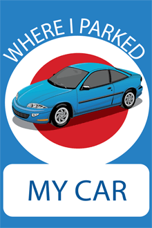

# Where-I-parked-my-car-
This is a web application which is used to bookmark a location of the car and find it on the map from anywhere. Its is developed uind HTML, CSS, Javascript and Jquery and is packaged using apache cordova.

## Getting Started
To run the application follow the steps
* Clone the reporsitory into your local windows machine.
* Only use Mozilla Firefox browser to open index.html page as firefox supports local server.
* Enjoy the application.

## Prerequisites
* Windows OS
* Mozilla Firefox Browser

## App Image

## Built With
* 'HTML'
* 'CSS'
* 'JavaScript'
* 'Jquery'
* 'Apache Cordova'

## Authors
[Ranjith D](https://github.com/Ranjith-D)
